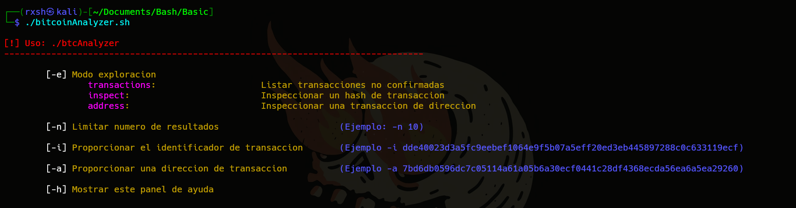
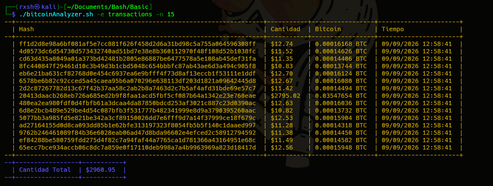
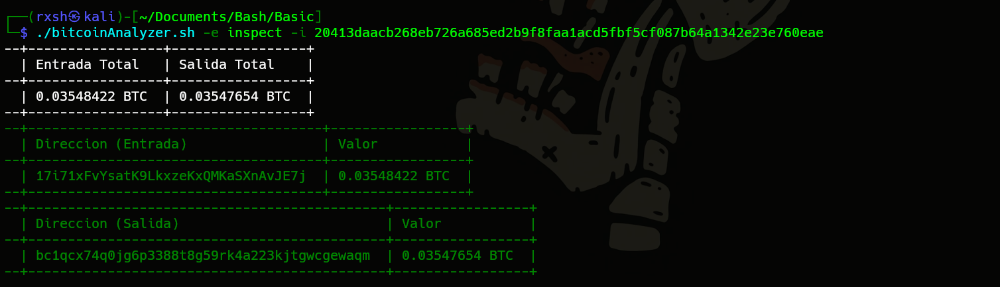
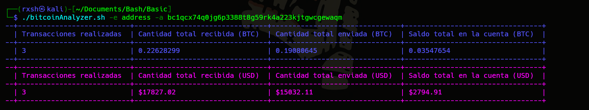

# Analizador de Bitcoins

Herramienta desarrollada en Bash para explorar e inspeccionar transacciones y direcciones de la red Bitcoin directamente desde la terminal. Utiliza la API oficial de Blockchain.info en formato JSON para extraer datos precisos, realizar conversiones en tiempo real a dólares (USD) y presentar la información en tablas dinámicas estructuradas.



## Características Principales

* **Exploración en tiempo real:** Lista las últimas transacciones no confirmadas (mempool) de la red Bitcoin.
* **Inspección de Hashes:** Desglosa transacciones individuales mostrando las direcciones de entrada, direcciones de salida y los valores exactos transferidos.
* **Análisis de Billeteras (Addresses):** Consulta el historial completo de una dirección específica (total recibido, total enviado, saldo actual y número de transacciones).
* **Conversión a Moneda Fiat:** Realiza cálculos matemáticos al vuelo usando `awk` para mostrar equivalencias exactas en dólares (USD) según la cotización actual del mercado.
* **Interfaz de Terminal:** Formateo automático de tablas con la herramienta `column` y código de colores para facilitar la lectura.

## Requisitos

El script hace uso de utilidades nativas de Linux y requiere un procesador JSON ligero. Asegúrate de tener instalados los siguientes paquetes en tu sistema:

* `curl` (para peticiones web)
* `jq` (para parseo de estructuras JSON)
* `awk` y `sed` (para cálculos de punto flotante y formateo de cadenas)

En distribuciones basadas en Debian/Kali Linux, puedes instalar las dependencias faltantes con:
```bash
sudo apt-get install curl jq awk sed
```

## Instalación

Clona este repositorio y otórgale permisos de ejecución al script principal:
```bash
git clone [https://github.com/tu-usuario/btcAnalyzer.git](https://github.com/tu-usuario/btcAnalyzer.git)
cd btcAnalyzer
chmod +x btcAnalyzer.sh
```

## Uso y Modos de Exploración

La herramienta funciona mediante el uso de parámetros. El modo de operación se define con la bandera `-e` (exploración), seguido de opciones adicionales de filtrado o búsqueda.

### 1. Transacciones No Confirmadas (transactions)
Muestra una tabla con las transacciones pendientes en la mempool. Puedes limitar la cantidad de resultados con la bandera `-n`.
```bash
./btcAnalyzer.sh -e transactions -n 15
```


### 2. Inspeccionar Transacción (inspect)
Muestra el desglose de entradas y salidas de una transacción específica. Requiere el hash de la transacción con la bandera `-i`.
```bash
./btcAnalyzer.sh -e inspect -i dde40023d3a5fc9eebef1064e9f5b07a5eff20ed3eb445897288c0c633119ecf
```


### 3. Inspeccionar Dirección (address)
Genera un estado de cuenta completo de una billetera Bitcoin, mostrando transacciones totales, balance histórico y saldo actual, tanto en BTC como en USD. Requiere la dirección con la bandera `-a`.
```bash
./btcAnalyzer.sh -e address -a 1KNm4K8GUK8sMoxc2Z3zU8Uv5FDVjrA72p
```


## Autor

* **Cesar Lengua** (aka rxshs3c)
